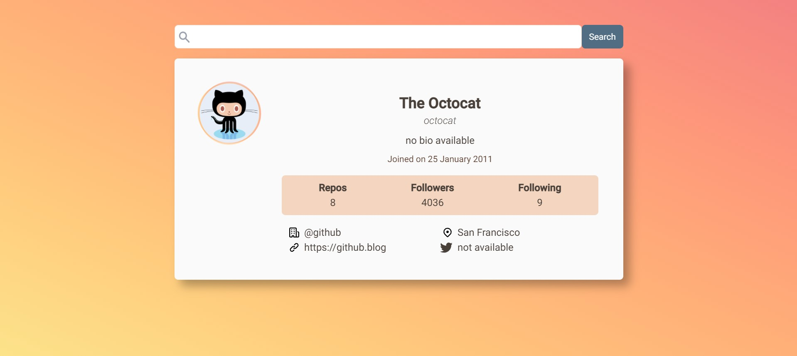
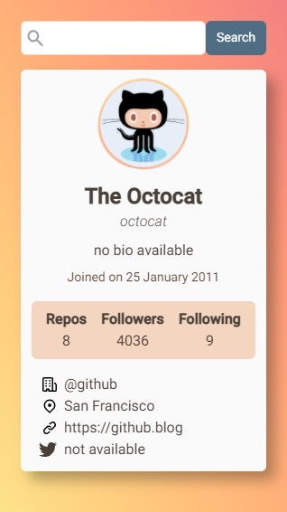

# Github profile card

Search a username and get a card showing info about that github profile.

## Screenshots

## About this project

This was made with the intention to continue practicing web development, this is not an original idea. In [Resources](#resources) I have listed all the sites that helped me to come up with this in one way or another 😊

## Usage

- Go to the following page 
- Enter the github username that you want to see in the card and press the Search button (a message will appear while loading the info). If the username wasn't found an error message will be displayed
- You can go to the github profile page if you press the username in the card (this will be open in a new tab). If they are available you can do the same for the link and twitter from the contact list

## Built with

- Semantic HTML5 markup
- CSS custom properties
- Flexbox
- CSS Grid
- Mobile-first workflow
- [Fetch API](https://developer.mozilla.org/en-US/docs/Web/API/Fetch_API)
- [Tailwind CSS](https://tailwindcss.com/) - CSS framework
- [PostCSS](https://postcss.org/)

## Resources

- The real inspiration comes from this [Frontend Mentor challenge](https://www.frontendmentor.io/challenges/github-user-search-app-Q09YOgaH6). I've seen github cards and profile viewers that listed the repositories but after seeing this I wanted to make my own profile card.
- [How to Convert a Date String into a Human-Readable Format](https://css-tricks.com/how-to-convert-a-date-string-into-a-human-readable-format/) - Here Sarah Drasner explained in an easy way how to display dates that come with the ISO 8601 format.
- The blank profile picture was made by [Stephanie Edwards](https://pixabay.com/users/wanderercreative-855399/?utm_source=link-attribution&utm_medium=referral&utm_campaign=image&utm_content=973460) from [Pixabay](https://pixabay.com/?utm_source=link-attribution&utm_medium=referral&utm_campaign=image&utm_content=973460).
- I could create a magnifying glass icon for the search input using [Mediamodifier](https://mediamodifier.com/design).
- [John Grishin's codepen](https://codepen.io/exah/pen/Lqyem) fascinated me the first time I saw it. I took this chance to use a border like the middle one for the profile picture.

## License

This project is licensed under the terms of the [MIT license](https://github.com/bmirandach/github-card/blob/master/LICENSE).